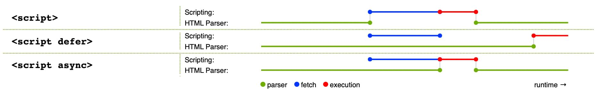

# javascript가 뭔가요?

**Javascript가 뭔가요?**

JavaScript는 프로토타입 기반, 단일 스레드, 동적 언어로 객체지향형, 명령형, 선언형(함수형) 스타일을 지원합니다.

기본적으로, 무엇이든. 자바스크립트의 모든 것은 객체(object)입니다.

함수에서 return을 하는 이유 : 함수 안에서 정의된 변수는 오직 그 함수 내부에서만 사용 가능하기 때문입니다.

**브라우저 API**는 웹 브라우저에 내장된 API로, 현재 컴퓨터 환경에 관한 데이터를 제공하거나 여러가지 유용하고 복잡한 일을 수행합니다.

대표적인 브라우저 API로는 DOM API, Geolocation API, Canvas, WebGL API 등이 있습니다.

**브라우저 보안**

각각의 브라우저 탭은 코드를 실행하기 위한 독립적인 그릇(기술 용어로 "실행 환경"이라고 부릅니다)입니다. 독립적이라는 것은 대부분의 탭이 서로에게서 완전히 분리되어 한 탭의 코드가 다른 탭의 코드, 또는 다른 사이트에 직접적인 영향을 줄 수 없다는 뜻입니다.

**인터프리터와 컴파일러**

인터프리터를 사용하는 언어에서는 코드를 위에서 아래로 실행하고, 코드 구동 결과는 즉시 반환됩니다. 브라우저에서 JavaScript 코드를 실행하기 전에 다른 형태로 변환할 필요가 없다는 점을 기억하세요. 코드는 프로그래머가 읽을 수 있는 형태로 입력되고, 별도의 처리 없이 그대로 실행됩니다.

컴파일러를 사용하는 컴파일 언어에서는 컴퓨터가 코드를 실행하기 전에 다른 형태로 변환(컴파일)해야 합니다. 예를 들어, C/C++

JavaScript는 가볍고, 인터프리터를 사용하는 프로그래밍 언어입니다. JavaScript는 인터프리터 언어로 분류됩니다. 컴파일을 먼저 해놔야 하는 것이 아니라 런타임에 일어나기 때문입니다.

**서버사이드와 클라이언트 사이드 코드**

웹 개발에 관련한 또 다른 용어로 **서버 사이드 코드**와 **클라이언트 사이드 코드**를 들어봤나요? 클라이언트 사이드 코드는 사용자의 컴퓨터에서 동작하는 코드입니다. 웹 페이지를 방문하면 브라우저가 페이지 내의 클라이언트 사이드 코드를 다운로드하고 실행해서 화면에 띄웁니다. 바로 이 과정에서 다루는 것은, 정확히는 **클라이언트 사이드 JavaScript**입니다.

**스크립트 로딩 전략**

HTML 본문을 읽기 전에 문서의 헤드에서 JavaScript를 불러와 실행합니다. 여기서 문제가 생길 여지가 있습니다. 예를 들어 아직 존재하지 않는 돔에 대한 접근을 시도할 수 있습니다.

`DOMContentLoaded` 이벤트를 사용하면. 이 블록 내부의 JavaScript는 이벤트가 발생하기 전에는 실행되지 않으므로 로딩 시점으로 인한 오류를 예방할 수 있습니다.

```jsx
document.addEventListener('DOMContentLoaded', () => {
  ...
});
```

`defer` 특성은 브라우저가 `<script>` 태그를 마주쳐도 그 이후의 HTML 콘텐츠를 계속 불러오도록 지정합니다.

```jsx
<script src='script.js' defer></script>
```

고전적인 방법은 스크립트 요소를 본문의 맨 마지막(`</body>` 태그 바로 앞)에 배치하는 것입니다. 그러면 모든 HTML을 읽은 후에 스크립트를 불러오게 됩니다. 이 방법의 문제는 HTML DOM을 모두 불러오기 전에는 스크립트의 로딩과 분석이 완전히 중단된다는 점입니다. 그래서 많은 스크립트를 포함하는 대형 사이트에서는 성능이 저하될 수 있습니다.

`async` 특성을 지정하면 스크립트를 가져오는 동안 페이지 로딩을 중단하지 않습니다. 그러나 스크립트 다운로드가 끝나면 바로 실행되는데, 실행 도중에는 페이지 렌더링이 중단됩니다. 스크립트의 실행 순서를 보장할 방법은 없습니다. 따라서 `async`는 다른 스크립트에 의존하지 않는 독립 스크립트에 사용해야 합니다.

`defer` 특성을 지정한 스크립트는 페이지 내에 배치한 순서대로 불러오게 됩니다. 또한 페이지 콘텐츠를 모두 불러오기 전까지는 실행하지 않으므로, 페이지 요소를 수정하거나 추가하는 등 DOM 작업을 기대하는 스크립트에 유용합니다.



요약하자면,

- `async`와 `defer` 모두, 브라우저가 페이지의 다른 내용(DOM 등등)을 불러오는 동안 스크립트를 별도 스레드에서 불러오게 만듭니다. 덕분에 스크립트를 가져오는 동안 페이지 로딩이 중단되지 않습니다.
- `async` 특성을 지정한 스크립트는 다운로드가 끝나는 즉시 실행합니다. 실행은 현재 페이지 렌더링을 중단하며, 실행 순서는 보장되지 않습니다.
- `defer` 특성을 지정한 스크립트는 순서를 유지한 채로 가져오며 모든 콘텐츠를 다 불러온 이후에 실행합니다.
- 의존성 없는 스크립트를 불러온 즉시 실행하려면 `async`를 사용하세요.
- 다른 스크립트에 의존하거나 DOM 로딩이 필요한 스크립트에는 `defer`를 사용하고, 원하는 순서에 맞춰서 `<script>` 요소를 배치하세요.
