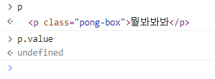

# JavaScript에 발 담그기

JavaScript에서 마주치고 조작하는 것의 대부분은 객체입니다. 객체란 서로 연관된 기능을 하나로 묶은 것입니다.

```jsx
const guessField = document.querySelector('.guessField');
```

`document` 객체의 `querySelector()` 메서드를 사용하는 모습입니다.

```jsx
guessField.focus();
```

`guessField` 는  `<input>` 요소의 참조를 담고 있으니, `guessField`는 다양한 속성(객체 안에 저장된 변수라고 생각할 수 있음, 일부 속성은 값을 바꿀 수 없음)과 메서드(객체 안에 저장된 함수)에 접근할 수 있습니다. 그 메서드 중 하나가 바로 `focus()`로, 다음과 같이 사용해서 텍스트 입력 칸에 포커스를 부여할 수 있습니다.

`<p>` 요에는 `value` 라는 속성이 없습니다. 만약 `p.value`를 호출한다면 `undefined` 값이 찍히게 됩니다. 문단의 텍스트를 바꾸려면 `textContent` 속성을 사용해야 합니다. 이렇게 해보세요.



페이지의 모든 요소에는 `style` 속성이 존재합니다. 이 속성은 해당 요소에 지정한 인라인 CSS 스타일을 모두 담고 있는 객체죠. 이걸 활용하면 JavaScript에서 요소의 CSS 스타일을 동적으로 제어할 수 있습니다.
