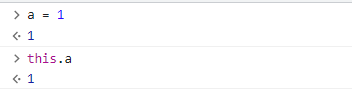
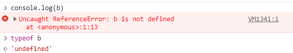
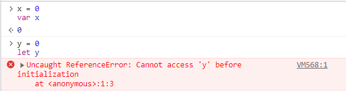

# var

**선언된 변수와 그러지 않은 변수**

어디에 선언이 되어있든 간에 변수들은 어떠한 코드가 실행되기 전에 처리가 됩니다. var로 선언된 변수의 범위는 현재 실행 문맥인데, 그 문맥은 둘러싼 함수, 혹은 함수의 외부에 전역으로 선언된 변수도 될 수 있습니다.



\*전역 오브젝트 또는 실행 콘텍스트, this, js는 모든 것이 객체이다.

선언된 변수들의 값 할당은 할당이 실행될 때 전역변수(이것은 전역 오브젝트의 프로퍼티가 됩니다)처럼 생성이 됩니다. 선언된 변수들과 선언되지 않은 변수들의 차이점은 다음과 같습니다:

1. 선언된 변수들은 변수가 선언된 실행 콘텍스트(execution context) 안에서 만들어집니다. 선언되지 않은 변수들은 항상 전역변수 입니다.

```jsx
function x() {
  y = 1; // strict 모드에서는 ReferenceError를 출력합니다.
  var z = 2;
}

x();

console.log(y); // 로그에 "1" 출력합니다.
console.log(z); // ReferenceError: z is not defined outside x를 출력합니다.
```

2. 선언된 변수들은 어떠한 코드가 실행되기 전에 만들어집니다. 선언되지 않은 변수들은 변수들을 할당하는 코드가 실행되기 전까지는 존재하지 않습니다.



```jsx
console.log(a); // ReferenceError를 출력합니다.
console.log('still going...'); // 결코 실행되지 않습니다.
```

```jsx
var a;
console.log(a); // 브라우저에 따라 로그에 "undefined" 또는 "" 출력합니다.
console.log('still going...'); // 로그에 "still going..." 출력합니다.
```

3. 선언된 변수들은 변수들의 실행 콘텍스트(execution context)의 프로퍼티를 변경되지 않습니다. 선언되지 않은 변수들은 변경 가능합니다. (e.g 삭제 될 수도 있습니다.)

```jsx
var a = 1;
b = 2;

delete this.a; // strict 모드에서는 TypeError를 출력합니다. 그렇지 않으면 자동적으로 실패합니다.
delete this.b;

console.log(a, b); // ReferenceError를 출력합니다.
// 'b' 프로퍼티는 삭제되었고, 어디에도 존재하지 않습니다.
```

이러한 세가지 다른점 때문에, 변수 선언 오류는 예기치않은 결과로 이어질 가능성이 높습니다. 그러므로 **함수 또는 전역 범위인지 여부와 상관없이, 항상 변수를 선언 하는 것을 추천합니다.**

**var hoisting**

변수 선언들 (그리고 일반적인 선언)은 어느 코드가 실행 되기 전에 처리하기 때문에, 코드 안에서 어디서든 변수 선언은 최상위에 선언한 것과 동등합니다. 이것은 변수가 선언되기 전에 사용 될 수 있다는 것을 의미합니다. 변수 선언이 함수 또는 전역 코드의 상단에 이동하는 것과 같은 행동을 "호이스팅(hoisting)"이라고 불립니다.

```jsx
bla = 2;
var bla;
// ...

// 위 선언을 다음과 같이 암묵적으로 이해하면 됩니다:

var bla;
bla = 2;
```

두 변수들의 선언 및 초기화

```jsx
var a = 0,
  b = 0;
```

단일 문자열 값으로 두 변수들 할당

```jsx
var a = 'A';
var b = a;

// 다음과 같음:

var a,
  b = (a = 'A');
```

순서에 유의

```jsx
var x = y,
  y = 'A';
console.log(x + y); // undefinedA
```

`x = y` 가 실행될 때, `y`는 존재하여 `ReferenceError를 출력하진 않고` 값은 '`undefined`' 입니다. 그래서, `x는` undefined 값이 할당 됩니다. 그리고 나서, `y` 는 `'A'` 값이 할당 됩니다.

<aside>
📢 그래서 var랑 let의 차이가 뭔데??

</aside>

`var`와 `let`은 JavaScript에서 변수를 선언하는 데 사용되는 두 가지 키워드입니다. 이 두 키워드는 변수의 범위와 할당에 대해 약간 다른 동작을 합니다.

`var`는 ES5 이전의 JavaScript에서 변수를 선언하는 데 사용되었습니다. `var`로 선언된 변수는 함수 범위(function scope)를 가집니다. 즉, 변수가 선언된 함수 내에서만 접근할 수 있습니다. 함수 내에서 선언된 `var` 변수는 해당 함수의 맨 위로 끌어올려지는(hoisting) 동작을 하기 때문에, 변수 선언 이전에도 참조할 수 있습니다.

예시:

```jsx
function example() {
  var x = 10;
  if (true) {
    var x = 20;
    console.log(x); // 출력: 20
  }
  console.log(x); // 출력: 20
}
```

ES6부터 도입된 `let`은 블록 범위(block scope)를 가지는 변수를 선언하는 데 사용됩니다. 블록 범위는 중괄호({})로 둘러싸인 영역 내에서만 변수에 접근할 수 있음을 의미합니다. 또한, `let`으로 선언된 변수는 호이스팅되지 않으므로 변수 선언 이전에는 접근할 수 없습니다.

예시:

```jsx
function example() {
  let x = 10;
  if (true) {
    let x = 20;
    console.log(x); // 출력: 20
  }
  console.log(x); // 출력: 10
}
```

결론 : `var` 대신 `let` 을 쓰자!



주의 : var나 let 키워드를 쓰지 않고 변수를 선언하면 전역변수로 생성됩니다.
